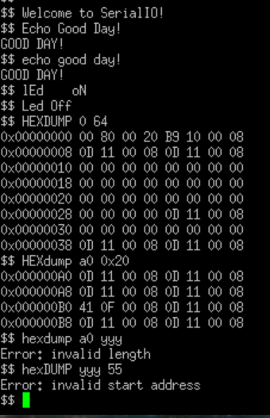
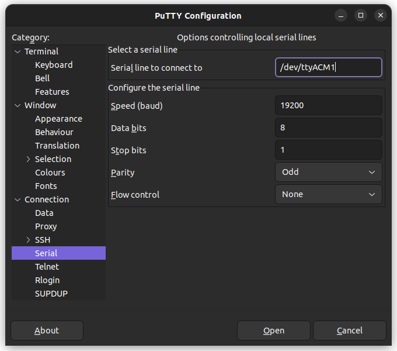

# Assignment 6 - Serial IO
Author: Matt Hartnett

Target Device: STM32 Nucleo-64 Development Board

Date: 11/11/2025

## Project Overview:
In this assignment, students will develop a command interpreter on the Nucleo-64 board, using USART2 with interrupts and queues for serial communication. Building on code from previous assignments, they will implement a system capable of processing multiple commands over a serial interface. Unlike earlier assignments, students are required to write their own USART2 initialization code, enhancing their understanding of UART configuration and control. Clock setup has been pre-configured in main.c, allowing students to focus on USART2 implementation and the command interpreter, advancing their embedded systems programming skills on the STM32 platform.

## Project Structure:
assignment6-serialio-HartnettMatt
├── .github/ # GitHub-specific configuration files 
├── .settings/ # IDE-specific settings for project configuration 
├── CMSIS/ # ARM Cortex Microcontroller Software Interface Standard files 
├── Debug/ # Build output and debug files 
├── Inc/ # Header files 
├── Lib/ # External libraries 
├── screenshots/ # Screenshots for documentation or reporting purposes 
├── Src/ # Source files 
│   ├── cbfifo.c # Circular buffer FIFO implementation 
│   ├── cbfifo.h # Circular buffer FIFO header file 
│   ├── field_access.h # Header file for bitwise field access macros/functions 
│   ├── hexdump.c # Hexadecimal dump utility implementation 
│   ├── hexdump.h # Header file for hexdump utility 
│   ├── log.h # Header file for logging functions 
│   ├── main.c # Main entry point for the project 
│   ├── process_cmd.c # Command processing implementation 
│   ├── process_cmd.h # Header file for command processing 
│   ├── syscalls.c # System calls implementation (standard I/O redirection) 
│   ├── sysmem.c # Memory management functions 
│   ├── test_cbfifo.c # Unit tests for cbfifo module 
│   ├── test_cbfifo.h # Header file for cbfifo tests 
│   ├── uled.c # User LED control implementation 
│   ├── uled.h # Header file for user LED control 
│   ├── usart.c # USART communication implementation 
│   └── usart.h # Header file for USART communication 
├── Startup/ # Startup files for initializing the microcontroller hardware 
├── README.md # Project documentation 
└── STM32F091RCTX_FLASH.ld # Linker script for STM32F091RCT microcontroller 

## Screenshots
As requested in the assignment document, here are the two screenshots, one showing a console interaction, and the other showing the Putty settings I used to connect.

These screenshots can also be found in the screenshots/ folder.

### Main Loop
The main loop in this code continuously waits for user input over a serial connection and processes commands entered by the user.

#### Initialization:
* Sets up the USART (Universal Synchronous Asynchronous Receiver Transmitter) interface for serial communication and the LED interface.
* Prints a welcome message to the terminal, indicating that the device is ready for interaction.

#### Prompt and Input Handling:
* Continuously displays a prompt ($$ ) on the terminal, indicating that it's ready to accept a command.
* Captures characters entered by the user in a buffer, buf, up to a maximum length of 128 characters.
* Supports typical command-line functionality, such as:
* Newline: Ends command input when the Enter key (\n or \r) is pressed.
* Backspace: Allows deleting characters by adjusting the buffer and updating the terminal display accordingly.
* Echoes each character back to the terminal as feedback.

#### Command Processing:
Once a newline is received, the complete command is null-terminated and passed to the process_command() function.
The process_command() function interprets the user’s command and executes the corresponding action. Further explaination below.
The loop then restarts, displaying a new prompt and waiting for further user input. This structure allows for responsive, continuous command processing, making the board behave like a serial command-line interface for various commands.

### Command Processor
The command processor accepts commands with flexible syntax, handling both uppercase and lowercase input, ignoring extra whitespace, and providing feedback for both valid and invalid commands. Below are the currently supported commands:

1. echo  
The echo command echoes back a provided string in uppercase, with extra spaces between words removed. This command is case-insensitive and accepts any sequence of characters as its argument.

2. led  
The led command controls the user LED on the board. By sending the command "led on", the led can be turned on, and "led off" turns it off. This command is case-insensitive.

3. hexdump  
The hexdump command displays a hexadecimal dump of memory, starting from a specified address and displaying a specified number of bytes. The output shows up to 8 bytes per line, which is useful for inspecting memory contents. The first parameter is the hexadecimal location in memory to begin hexdump. Do not include a "0x" with this first parameter. The second parameter is the number of bytes to dump, in either decimal or hex (preceed hex values with "0x").

#### Error Handling:
If an unrecognized command is entered, or if a command is issued without arguments, the processor will notify the user:

` Unknown command: <cmd> `

If an unrecognized LED command is entered, or if no arguments exist, the processor will notify the user:

` Unknown LED command`

If Start is not a valid hexadecimal address, the command processor will return:

` error: invalid Start address `

If Len is invalid (e.g., non-numeric or out of range), the processor will return:

` error: invalid length `

This command processor is designed for easy expansion, allowing future commands to be added with minimal changes to the main processing loop.

### Notes:
* ChatGPT was used to create the project structure display. It was not used in any other part of this project.
* Certain sections of code were taken from Alex Dean's github (https://github.com/alexander-g-dean). All relevant sections are marked as such.
* The certain files have been taken and modified from previous assignments. I was the original author then and now. The following code sections were taken from previous work:
    * cbfifo
    * uled
    * hexdump
    * log