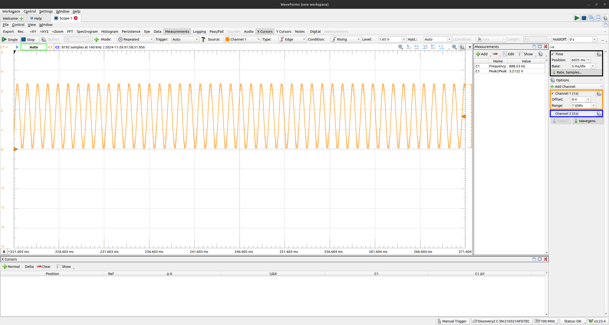

# Assignment 7 - Waveforms
Author: Matt Hartnett

Target Device: STM32 Nucleo-64 Development Board

Date: 11/26/2024

## Project Overview
In this project, we delve into the world of analog signals, implementing both Digital-to-Analog Conversion (DAC) and Analog-to-Digital Conversion (ADC) on the STM32 Nucleo-64 board. Using direct memory access (DMA) and timers, we generate and analyze pure tones, demonstrating real-time waveform synthesis and signal processing.

This project utilizes integer math to ensure accuracy and efficiency in embedded systems. The main objective is to generate four distinct musical tones (A4, D5, E5, A5) at specific frequencies, output them through the DAC, sample the signals back via the ADC, and perform basic analysis.

## Project Structure
assignment7-waveforms-HartnettMatt  
├── .github/          # GitHub-specific configuration files  
├── .settings/        # IDE-specific settings for project configuration 
├── CMSIS/            # ARM Cortex Microcontroller Software Interface Standard files 
├── Debug/            # Build output and debug files 
├── Inc/              # Header files 
│   ├── utilities.h   # Header file for utility macros and functions 
│   └── system_stm32f0xx.h # System configuration header 
├── Src/              # Source files 
│   ├── analog_in.h   # Header file for ADC input module 
│   ├── analog_out.h  # Header file for DAC output module 
│   ├── analysis.h    # Header file for data analysis module 
│   ├── fp_trig.h     # Header file for fixed-point trigonometry 
│   ├── analog_in.c   # ADC input module 
│   ├── analog_out.c  # DAC output module 
│   ├── analysis.c    # Data analysis module 
│   ├── main.c        # Main entry point 
│   ├── syscalls.c    # System calls implementation 
│   ├── sysmem.c      # Memory management functions 
│   ├── test_sine.c   # Testing for sine function 
│   └── utilities.c   # Utility functions 
├── Startup/          # Startup files for microcontroller initialization 
├── README.md         # Project documentation 
└── STM32F091RCTX_FLASH.ld # Linker script for STM32F091RCT microcontroller 
Note: ChatGPT was utilized to create this project directory layout. It was not used in any other portion of this project.

## Project Features
1. Waveform Generation:
Implements tone_to_samples() to generate buffers of 12-bit sine wave samples for A4, D5, E5, and A5 tones.
Configures the DAC with DMA to output these samples continuously at 48 kHz.
2. Analog Input:
Configures the ADC to sample the DAC output at 96 kHz using analog_in.c.
Uses DMA and timer triggers to avoid jitter.
3. Signal Analysis: This project computes and displays the following:
* Min, Max, and Mean values of the sampled signal.
* Fundamental Period using an autocorrelation algorithm.
* Outputs data through UART for user observation.
4. Oscilloscope Validation
Verifies waveform integrity at transitions using an oscilloscope connected to pin PA4. Screenshots included below.

## Running the Project
Hardware Requirements:
* STM32 Nucleo-64 Development Board
* Oscilloscope (for waveform analysis)
### Steps
1. Flash the program onto the STM32 Nucleo-64 board.
2. Connect the oscilloscope to pin PA4 to observe the waveforms.
3. Use a terminal emulator (e.g., TeraTerm or PuTTY) with the following settings:
* Baud Rate: 9600
* Parity: None
* Stop Bits: 1
4. Observe UART outputs for waveform and analysis details.

## Oscilloscope Screenshots:
Note the measurements on the side showing the frequency and PeakToPeak Voltage.

### 440 Hz:

### 587 Hz:

### 659 Hz:

### 880 Hz:

## Note:
Some code was borrowed from Alex Dean's GitHub. All sections are marked as such. Here is the link to his Github:
https://github.com/alexander-g-dean/ESF.git
