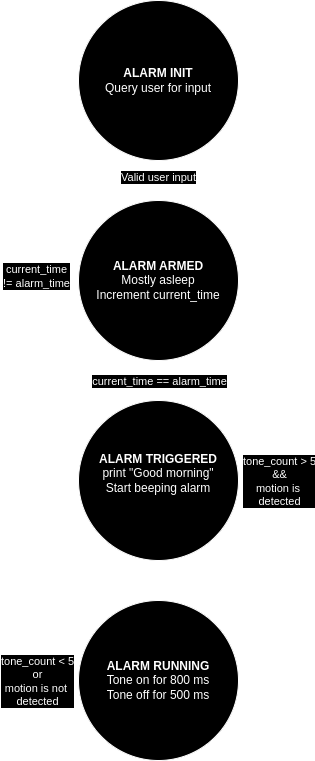

# Final Project - Motion Detecting Alarm Clock
Author: Matt Hartnett

Target Device: STM32 Nucleo-64 Development Board
Required Hardware: PIR Digital Motion Detector, Speaker or buzzer

Date: 12/09/2025

## Project Overview:
This project aims to design a motion-based alarm clock using the STM32 Nucleo-64 development board paired with a digital Passive Infrared (PIR) motion detector.
The alarm clock will be programmed to activate every set interval (for example, every 24 hours).
Once the alarm triggers, it will emit an alarm tone until motion is detected by the PIR sensor, at which point the alarm will deactivate.

## Project Operation:
This project operats off of a finite state machine for the majority of it's control.
The only operations that take place outside of the finite state machine are interrupt handlers, peripheral initializations, and the initial computation of the sine wave.
After sine wave computation and peripheral inits, the FSM asks the user for the current time and what time the alarm should go off.
Several formats are supported for the time, more information below.
After receiving the necessary information from the user, the processor enters the "armed state", where the processor is in a sleep mode that is interrupted every 100ms to increment the timer.
Once the timer matches with the set alarm, the alarm triggers and begins to sound tones off.
5 tones play no matter what to ensure the user wakes up, then after those 5 tones, motion stops the alarm tones.
After the alarm is turned off, it re-enters the armed state to wait for tomorrow's alarm.

## Finite State Machine

This diagram, as well as a PDF version, can be found in the diagrams folder.

## Operation Guide:
In order to operate this system, a digital PIR is required, along with a buzzer or speaker.
The digital PIR output needs to be connected to pin PA3, and the buzzer needs to be connected to PC5.
Once the system is connected, plug the F091RC USB in.
For the serial connection, the settings are as follows:
 * 9600 Buad Rate
 * 8 data bits
 * No parity
 * No stop bits

Follow the prompts and enjoy the alarm!

## Acceptable Time Formats
The system is designed to be as flexible as possible when it comes to time formats.
Millitary and standard time are accepted.
The usual format is as follows: <hours:minutes AM/PM>.
If AM/PM are not specified, then the time is assumed to be in millitary time.
The colon is suggested, but not required.
### Examples:
* 4:00 PM
* 400 PM
* 0400 PM
* 1600
* 16:00

## Project Structure:
final-project-HartnettMatt  
├── .settings/ # IDE-specific settings for project configuration 
├── CMSIS/ # ARM Cortex Microcontroller Software Interface Standard files 
├── Debug/ # Build output and debug files 
├── Diagrams/ # Folder containing project diagrams 
│ └── FinalProjectFSM.drawio.pdf # Finite State Machine diagram in PDF format 
│ └── FinalProjectFSM.drawio.png # Finite State Machine diagram in PNG format 
├── Inc/ # Header files 
├── Lib/ # External libraries 
├── Src/ # Source files 
│ ├── analog_out.c # Analog output implementation 
│ ├── analog_out.h # Header file for analog output functions 
│ ├── button.c # Button interface implementation 
│ ├── button.h # Header file for button interface 
│ ├── cbfifo.c # Circular buffer FIFO implementation 
│ ├── cbfifo.h # Circular buffer FIFO header file 
│ ├── dig_in.c # Digital input interface implementation 
│ ├── dig_in.h # Header file for digital input interface 
│ ├── log.h # Header file for logging functions 
│ ├── main.c # Main entry point for the project 
│ ├── process_time.c # Time processing functions implementation 
│ ├── process_time.h # Header file for time processing 
│ ├── sine.c # Sine wave generation implementation 
│ ├── sine.h # Header file for sine wave generation 
│ ├── sleep.c # Sleep and delay functions implementation 
│ ├── sleep.h # Header file for sleep and delay functions 
│ ├── syscalls.c # System calls implementation (standard I/O redirection) 
│ ├── sysmem.c # Memory management functions 
│ ├── systick.c # SysTick timer management implementation 
│ ├── systick.h # Header file for SysTick timer management 
│ ├── usart.c # USART communication implementation 
│ └── usart.h # Header file for USART communication 
├── Startup/ # Startup files for initializing the microcontroller hardware 
├── README.md # Project documentation 
└── STM32F091RCTX_FLASH.ld # Linker script for STM32F091RCT microcontroller 

### Notes:
* ChatGPT was used to create the project structure display. It was not used in any other part of this project.
* Certain sections of code were taken from Alex Dean's github (https://github.com/alexander-g-dean). All relevant sections are marked as such.
* The certain files have been taken and modified from previous assignments. I was the original author then and now. The following code sections were taken from previous work:
    * analog_out
    * button
    * cbfifo
    * log
    * usart